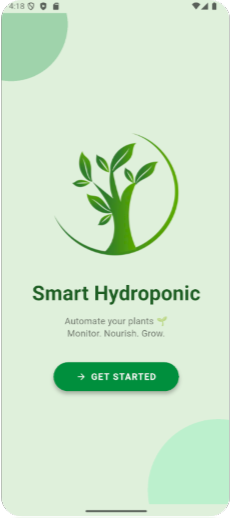
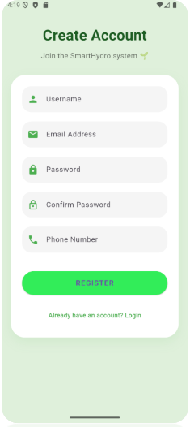
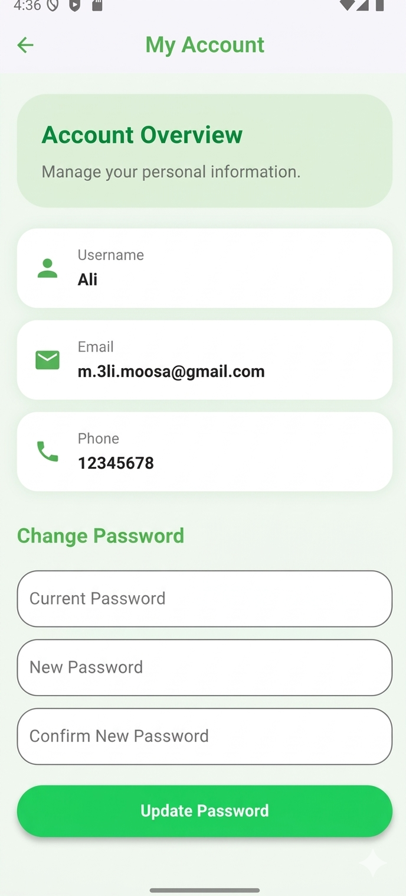
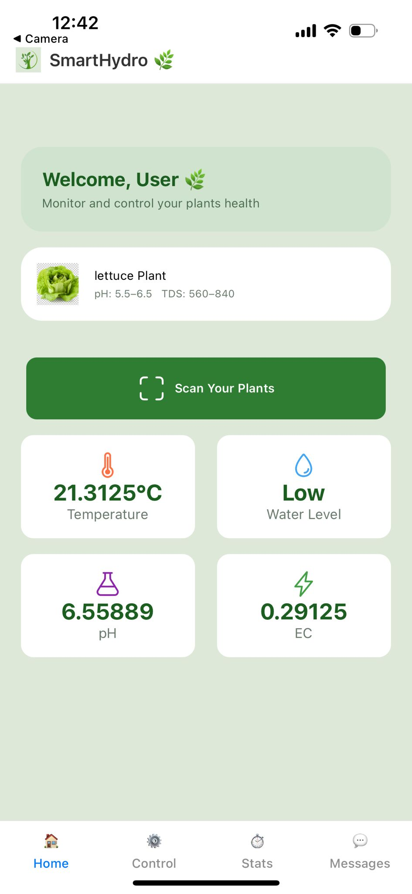
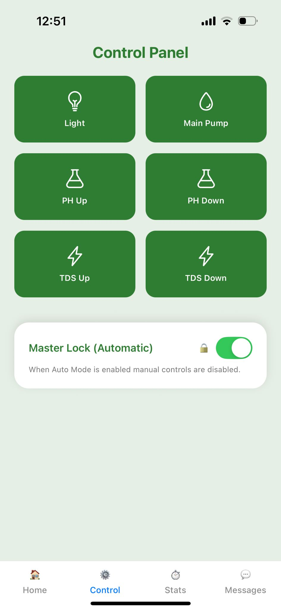
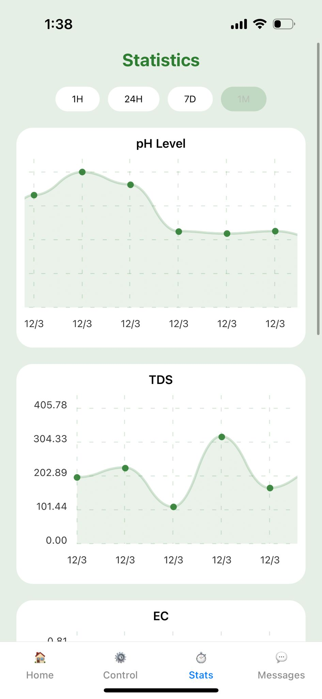
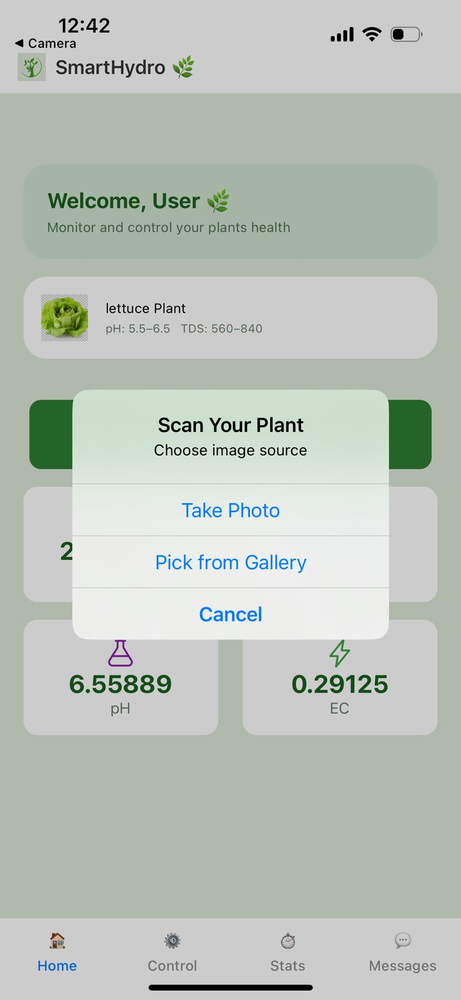
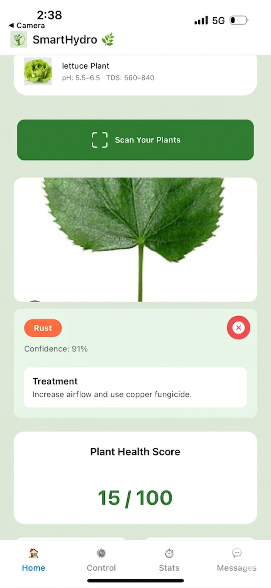
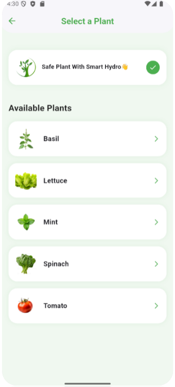

# SmartHydro 🌿  
AI-Powered Hydroponic Monitoring and Plant Disease Detection System

SmartHydro is an IoT + AI hydroponic monitoring system that combines ESP32 sensors, cloud services, and deep learning to monitor plant health and detect diseases automatically using a CNN model.

The system provides real-time environmental monitoring, AI disease diagnosis, and automated hydroponic control through a mobile application.

---

# System Preview

## Dashboard Screen

## Manual Control Page

## Sensor Chart Readings

---

## AI Plant Scan

## AI Plant Scan Result 

Allows the user to:

• Take a photo of the plant  
• Upload from gallery  
• Run AI disease detection  
• Receive treatment advice  

---

## Plant Selection Screen

Shows supported plants and recommended hydroponic ranges.

Example plants:

• Lettuce  
• Basil  
• Tomato  
• Mint  

---

## Hydroponic Device

Hardware setup includes:

• ESP32 microcontroller  
• pH sensor  
• EC sensor  
• TDS sensor  
• Temperature sensor  
• Water level sensor  
• Main water pump  
• 3 small solution pump  
---

# Mobile Application

Technology stack:

• React Native  
• Expo  
• Firebase  
• REST API
• Google Cloud Srvice  

Features:

• Real-time sensor monitoring  
• AI plant disease detection  
• Hydroponic device control  
• Plant health score calculation  
• Plant selection and configuration  

---

# AI Disease Detection

The system uses a Convolutional Neural Network trained using MindSpore.

Supported disease classes:

healthy  
leaf_blight  
rust  
powdery_mildew  
leaf_spot  

# Cloud Infrastructure

Platform:

Google Cloud Run

Services used:

• FastAPI  
• Docker  
• Cloud Build  
• Firebase Admin SDK  

---

# License

Educational / Research Project / create by Ali Hussain Moosa 2026
